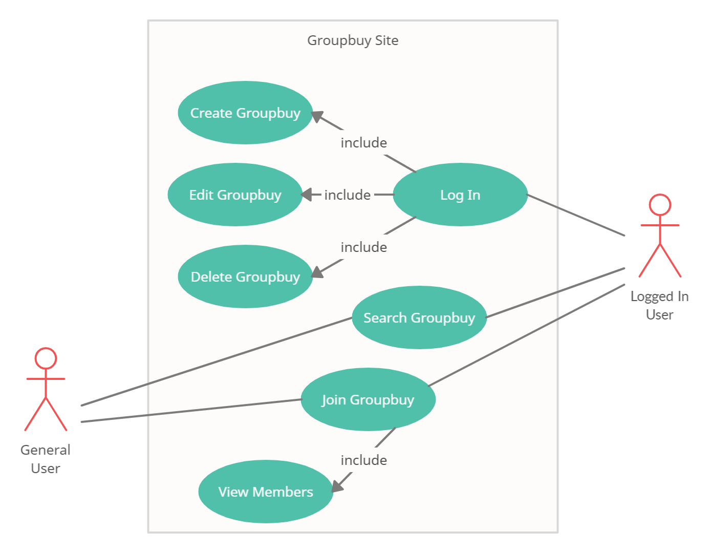

# Tompang.sg - A Groupbuy Site
## Summary
### Purpose
The goal of this project is to create a platform for anyone to organize or join a groupbuy. The site provides useful features, tailored for both logged-in users and general users. 

Most groupbuys are organized privately, over chat platforms or in social media. A web platform with dedicated features for groupbuy activities can bring the groupbuy community together.

### Context
This website is a single page application, created using Vue, supported by Express and MongoDB for data management.

The website provides features such as:
* Creating, editing and deleting groupbuys for logged-in users
* Searching and joining of groupbuys for all general users

### Demo
A live website can be accessed here:

https://kind-chandrasekhar-fe2621.netlify.app/#

## UX/UI
### Identifying Users
The main users for this website are:
* Organizers who want to initiate a groupbuy activity
* Buyers who want to join a groupbuy activity

### Identifying Users' Needs and Goals
There are two groups of people in a groupbuy activity: the organizer and the members who joined the group.

The organizers are the ones who can get a good deal for bulk buying an item. They would need to get a group of people on board to fulfil the deal.

The members are the ones who want to buy a particular item for a good price, but do not know where to find it or be involved in the hassle of getting it. A groupbuy provides the perfect opportunity of convenience and value.

### Identifying Owners' Goals
The site owners’ goal is to provide a user-friendly platform for groupbuy activities. This encourages the spirit of sharing and bring the groupbuy community closer together.

### User Stories
As a user of the site, I would like to:
* Create a groupbuy and find like-minded people to share in bulk buying a product
* Find a groupbuy for a particular item, that is near my location of convenience
* Buy a product at a cheaper price, but save the hassle of sourcing for it

### UX
The site is designed as a single page linear structure, with mobile-friendliness in mind. The site caters for two groups of users: the organizers, who want to start a groupbuy, and the general users, who browse for wares and are interested in joining a groupbuy.

On first access to the landing page, a general user can immediately search for a groupbuy, using a list of criteria such as product name, location, product tags, product categories and price range. The search result will be show below the search section in a card listing manner. In each card, the groupbuy information is displayed and the user has the option to join the groupbuy. Upon clicking the ‘Join Group’ button, the user is prompted with a dialog to enter first name, last name and contact info.

An organizer user needs to log in via the ‘Log In’ button to access more features, including creating a new groupbuy, editing an existing groupbuy and deleting a groupbuy. To create a new groupbuy, user can click on the ‘Create Groupbuy’ link that is only visible to logged-in users at the top navigation bar. The user is brought to the ‘Create Groupbuy’ page. The user needs to enter all mandatory fields and submit the form. A new groupbuy group will be listed in the result panel and is searchable. 

The menu for editing and deleting of groupbuy groups are found together with the ‘Join Group’ button in each groupbuy card. Each groupbuy card also allows the organizer user to view member details who have joined the group.

### UI
A minimalistic colour scheme is used to give the website a clean look and cursive fonts are used for the logo and page titles to evoke a casual feel.

The top navigation bar features navigation links and a log in button. Below it is the search function section. It consists of a search bar, query button, reset search button and filter parameters. The search result will be displayed below in a list of cards. A result counter is displayed at the top of the result panel.

Each card displays information in the following order:
* Group Name/Product Name
* Group owner’s username
* Group owner’s contact
* Group description
* Product category
* Price
* Location of collection
* Maximum members allowed to join
* Deadline
* Product tags
* Number of members that have joined the group

A button menu is located at the card footer. ‘Join Group’ button is visible to all. ‘Edit Group’ and ‘Delete Group’ buttons are only visible to logged in users. Create Group and Edit Group features use the same form for display. Join Group, View Member Details and Delete Group features make use of a modal dialog.

A detailed wireframe diagram can be found [here.](docs/Landing.pdf)

## Use Cases
The use case diagram below depicts the roles that a logged-in user and a general user can perform in the site. Log in is simulated as authentication function cannot be implemented.

## Technologies Used
The programming languages, frameworks, tools and APIs used in the creation of the website are listed below:
* HTML5
* CSS3
* JavaScript
* Bootstrap
* Bootstrap Icons
* Vue.js
* Moment.js
* Axios
* Express
* MongoDB

The RESTful API used by this site can be found [here.](https://github.com/waihouC/Project-Assignment-2-Express)

## Testing
Testing is done mainly on the following devices, and in conjunction with Chrome Developer Console:
* Google Chrome on desktop
* Microsoft Edge on desktop
* Google Chrome on Samsung S21+
* Safari on iPhone X

Please refer to the test cases [here.](docs/Assignment-2-test-cases.pdf)

## Credits
This project is made possible with the following help:
* https://css-tricks.com/full-width-containers-limited-width-parents/
* https://stackoverflow.com/questions/34308004/moment-js-with-vuejs
* https://momentjs.com/docs/
* https://www.npmjs.com/package/vuejs-datepicker
* https://vuejs.org/v2/guide/transitions.html
* https://michaelnthiessen.com/force-re-render/
* https://docs.mongodb.com/manual/

And instructors’ advice from Trent Global College.